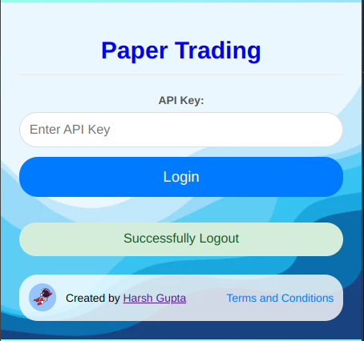
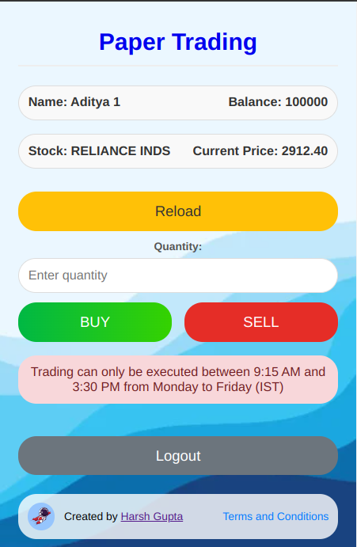
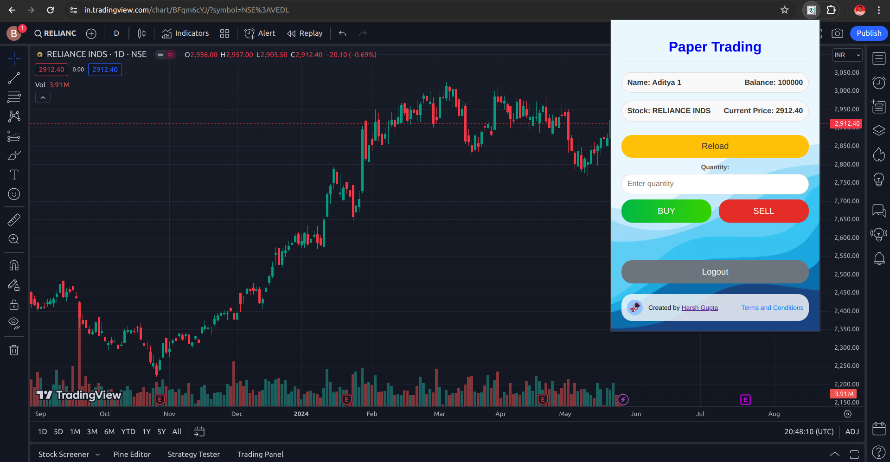

# Paper Trading Extension

<p align="center">
  
</p>

<p align="center">
  <a href="https://github.com/yourusername/paper-trading-extension/releases">
    
  </a>
  <a href="https://opensource.org/licenses/Apache-2.0">
    
  </a>
</p>

## Project Overview

Introducing **Paper Trading Chrome Extension**, a state-of-the-art platform meticulously designed for both aspiring traders and seasoned investors. Leveraging the robust capabilities of TradingView, this extension empowers users to simulate real-time stock trading in a completely risk-free environment. Through the use of virtual currency, users can seamlessly buy and sell stocks, refining their trading strategies with zero financial risk.

## Key Features

- **Real-Time Market Data:** Gain access to live market data directly from TradingView, ensuring you always trade with the most current information.
- **Intuitive User Interface:** Enjoy a sleek, user-friendly interface designed to make trading easy and enjoyable, even for beginners.
- **Comprehensive Portfolio Management:** Track your trades and monitor portfolio performance with detailed analytics and reporting tools.
- **Risk-Free Trading with Virtual Currency:** Practice and refine your trading strategies by using virtual currency in a completely safe environment.
- **Advanced TradingView Integration:** Benefit from seamless integration with TradingView, allowing you to utilize advanced charting tools, technical analysis, and other premium features.

## Installation

This extension works with Chromium-based browsers such as Chrome, Brave, Edge, etc.

To install the Paper Trading Chrome Extension, follow these steps:

1. **Clone the repository:**
    ```bash
    git clone https://github.com/dudegladiator/Paper-Trading-Extension
    ```
    
    or download the zip file:  Click the big blue "Code" button, and then click "Download ZIP".

2. **Extract the contents of the zip file:**
    - Right-click on the downloaded zip file, then click "Extract Here".
    - Save it somewhere, if you delete, you will loose the extension too.

3. **Open the extension page in your Chromium browser:**
    - Option 1: Type `chrome://extensions` in the URL bar and press Enter.
    - Option 2: Click on the three dots in the top right of the browser, then click on "Extensions".

4. **Activate developer mode:**
    - Turn on the switch on the top right of the page that says "Developer mode".

5. **Load unpacked extension:**
    - Click on the button on the top left of the page that says "Load unpacked".
    - Then select the folder that contains the `manifest.json` file.

## Benefits

- **Risk-Free Learning**: Perfect for beginners to learn trading without real money risk.
- **Enhanced Decision Making**: Gain insights with detailed performance reports and analytics.
- **Convenience**: Accessible from your Chrome browser for easy, anytime trading.
- **Competition Organization**: Participate in trading competitions to challenge yourself and others.


## How It Works

1. **Install the Extension**: Download and install the Paper Trading Chrome Extension.
2. **Create an Account**: Fill out the form to get an API key.
3. **Start Trading**: Use virtual currency to buy and sell stocks, utilizing integrated TradingView tools.
4. **Track Performance**: Monitor your portfolio and review analytics to refine strategies.


## Usage

Currently, usage is limited to certain users via an API key. To request access, please register <a href="https://forms.gle/kHTc9CzKCBm5BGmu7" target="_blank">here</a>.


## Screenshots

<p align="center">
  
  
</p>

<p align="center">
  
</p>

## Target Audience
- **Beginner Traders**: Individuals who are new to the stock market and want to learn trading in a safe, risk-free environment.
- **Educational Institutions**: Schools and universities offering courses in finance and trading can use the extension as a practical learning tool.

## Risks

While our Paper Trading Chrome Extension provides a risk-free environment for practicing trading strategies, please be aware of the following:

- **Market Dynamics:** Real market conditions may differ from simulated environments. Always consider real market factors and risks when transitioning to live trading.
- **Data Accuracy:** While we strive to provide accurate and up-to-date data, there may be occasional discrepancies or delays.
- **No Financial Advice:** This extension is for educational purposes only and should not be considered as financial advice.

## Contributing

We welcome contributions to improve the Paper Trading Chrome Extension! Here are some ways you can contribute:

1. **Report Bugs**: If you encounter any issues, please report them by creating a new issue on our [GitHub Issues](https://github.com/yourusername/paper-trading-extension/issues) page.
2. **Suggest Features**: Have an idea for a new feature? Suggest it by opening a feature request on our [GitHub Issues](https://github.com/yourusername/paper-trading-extension/issues) page.
3. **Submit Pull Requests**: If you'd like to contribute code, fork the repository and submit a pull request. Please ensure your code adheres to our coding standards and includes appropriate tests.
4. **Improve Documentation**: Help us improve our documentation by suggesting enhancements or correcting inaccuracies.


Thank you for your interest in contributing to the Paper Trading Chrome Extension!


## License

This project is open source and licensed under the Apache-2.0 License. See the [LICENSE](LICENSE) file for details.


## Authors

- **Harsh Gupta** - [dudegladiator](https://github.com/dudegladiator)

## Conclusion
Our Paper Trading Chrome Extension is the ultimate tool for anyone looking to delve into the world of stock trading. With its seamless integration with TradingView and a host of powerful features, users can enjoy a comprehensive trading experience without any financial risk. Start your trading journey today and become a more confident, informed trader with our innovative extension.
